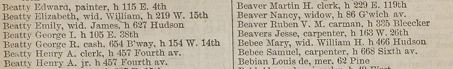

# city-directory-entry-parser

city-directory-entry-parser parses lines from OCR’d [New York City directories](https://digitalcollections.nypl.org/search/index?utf8=%E2%9C%93&keywords=city+directories) into seperate fields, such as names, occupations, and addresses.

city-directory-entry-parser is part of NYPL’s [NYC Space/Time Directory](http://spacetime.nypl.org) project.

For more tools that are used to turn digitized city directories into datasets, see Space/Time’s [City Directories repository](https://github.com/nypl-spacetime/city-directories).

## Example



Input:

    "Bebee Samuel, carpenter, h 668 Sixth av."

Output:

```json
{
  "subject": [
    {
      "value": "Bebee Samuel",
      "type": "primary",
      "occupation": "carpenter"
    }
  ],
  "location": [
    {
      "value": "668 Sixth av.",
      "type": "home"
    }
  ]
}
```

If the output contains a `location` field with a street address, [nyc-street-normalizer](https://github.com/nypl-spacetime/nyc-street-normalizer) can be used to turn this abbreviated address into a full address (e.g. `668 Sixth av.` ⟶ `668 Sixth Avenue`).

## Installation & usage

From Node.js:

    npm install --save nypl-spacetime/city-directory-entry-parser

```js
const parser = require('@spacetime/city-directory-entry-parser')

console.log(parser('Pfeffer Conrad, cabinetmaker, h. 478 Twelfth'))
```

From the command line:

    npm install -g nypl-spacetime/city-directory-entry-parser

    city-directory-entry-parser "Pfeffer Conrad, cabinetmaker, h. 478 Twelfth"

## See also

  - [NYC Space/Time Directory](http://spacetime.nypl.org)
  - [hocr-detect-columns](https://github.com/nypl-spacetime/hocr-detect-columns)
  - [nyc-street-normalizer](https://github.com/nypl-spacetime/nyc-street-normalizer)
